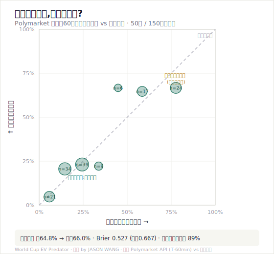
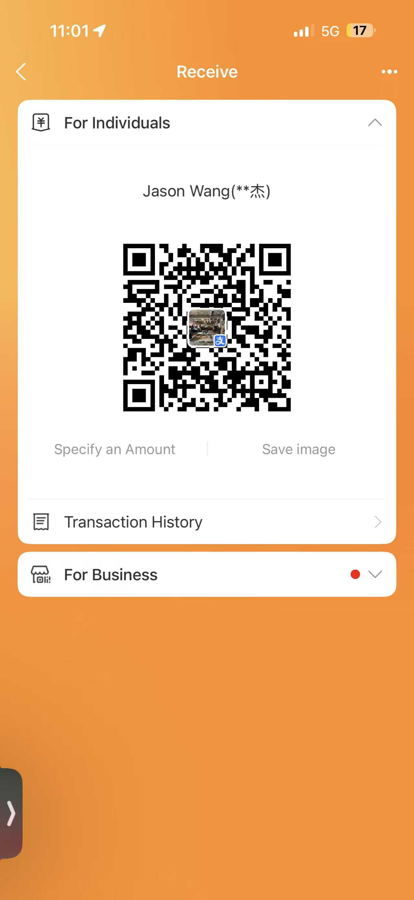

# ⚡ World Cup EV Predator · 世界杯 EV 狩猎者

**A value-betting / EV engine for China Sports Lottery football (体彩竞彩足球).**
> Developed by **JASON WANG** · 开发者 **JASON WANG** · MIT licensed · open source

---

# 🇬🇧 The house already won — the moment you paid

It's not that you don't know football. The game is *built* so you bleed out slow.

The house edge isn't luck. It's the **margin** — 6 to 12% skimmed off every match, more at the World Cup. Before the whistle blows, you're already down. Not a conspiracy; it's math baked into the rules. Over ten years and a million tickets, the machine grinds every retail bettor down to the cent.

And here's the dirty part: **the cut isn't spread evenly.** It's piled thickest exactly where you love to bet — the short-priced favorite, "the strong team obviously wins." The safer it feels, the harder you're robbed. 体彩 knows you'll back Germany, so it crushes Germany's price to the bone, and you hand over your money with a smile.

For years, retail has been the house's feed. The real probabilities, the real prices — the smart money always had them. You never did. You were always the one left holding the bag.

**But you remember GameStop, right?**

That was the moment a crowd of retail saw the cards in the house's hand and said: *we're not playing by your rules anymore.*

**This project is the light you shine on that table.** Open source. Free. It does one thing: it slaps the real probabilities — forged by millions in live money — right onto your face, so for the first time you see exactly how many points the house just took from you, and how your beloved parlay funnels your cash into its mouth, slip by slip.

We don't promise you'll get rich (read on — we'll tell you why nobody can). We promise one thing: **you stop being the mark. You cut the house's tax to the lowest on the internet. Together.**

### Why #1: the smart money is genuinely accurate — I backtested 50 matches

Every finished match this World Cup, I pulled Polymarket's real traded price at exactly **T-minus-60-minutes** and graded it against the **actual scoreline**. 50 matches, 150 outcome legs.

The market says "24% happens," it happened 23%; says "58%," it cashed 65% — **the dots sit right on the perfect line.** Brier score 0.527 (a coin-flip is 0.667); strip out draws and the top pick hits 89%. That's the "true win probability" you've been dreaming of.
*(Honest caveat: Polymarket only, 50 matches — small, thin buckets are noisy, all marked on the chart. Pinnacle and the exchange weren't separately backtested — but in live pulls all four agreed within 1.5 points. Reproduce it: [`assets/make_calibration_chart.py`](assets/make_calibration_chart.py).)*

### Why #2: the margin is hidden — and we can see it

Same match, **Japan vs Sweden**: bet Japan to win, EV **−18%**; bet the draw nobody wants, EV **≈0%** — basically free. One bleeds you out, one barely costs a thing, and the gap is hidden where you never look. This model strips every bet bare and shows you where the margin is thin — bet the thin, walk past the thick.

### Why #3: parlays are the trap — singles are the way out

A parlay *feels* like swinging for the fences. It actually **multiplies** the margin. Same handful of matches: as a 2-leg parlay, −22% expected; as singles, −1.5%. The house's favorite customer is the guy clutching a short-odds parlay at 2 a.m. Don't be that guy.

### Finally, the hard truth: you can't beat the house

Long term you can't, nobody can, and anyone selling "guaranteed wins" is lying. This model won't make you win — it makes you **lose the least, weld the floor shut, and occasionally steal a lucky night.** Bet only what you can afford to lose. See the margin. Never parlay.

*That's* what we mean by **Beat the house**: not knocking it out — you can't — but never again kneeling to feed it.

---

# 🇨🇳 体彩这台机器,从你掏钱那一刻就赢了

不是你不懂球。是这游戏的规则,本来就设计成让你慢慢输。

庄家的优势不叫运气,叫**水位**——每一场,它先从盘口抽走 6% 到 12%,世界杯更狠。你还没下注,钱已经少了一截。这不是阴谋论,是写死在规则里的数学。十年、一百万张彩票,这台机器一分不差地碾过每一个散户。

更阴的是:**这刀不是平着切的。** 它专门加厚在你最爱买的地方——"强队肯定赢"的短赔热门。你越觉得稳,它宰得越狠。体彩太清楚你会买德国了,于是把德国的价压到骨头里,你还以为捡了便宜,笑着把钱递过去。

这些年,散户就是体彩的饲料。真实的概率、真实的赔率,聪明钱手里一直攥着,你从来没份——你永远是后知后觉、接最后一棒的那个。

**但你还记得 GameStop 吗?**

那一回,一群散户突然看清了庄家手里的牌,然后撂下一句话:这游戏,老子不按你的规矩玩了。

**这个项目,就是照向那张牌桌的灯。** 开源、免费。它只干一件事:把那些百万真金堆出来的"真实概率"直接糊到你脸上,让你头一回看清——这一注,庄家到底宰了你几个点;你那张引以为傲的串关,又是怎么一层层把钱喂进它嘴里的。

我们不承诺你暴富。我们只承诺一件事:**让你不再当那个冤大头。把交给庄家的智商税,砍到全网最低。一起。**

**凭什么之一:聪明钱真的准——我扒了 50 场。** 上面那张校准图:市场说"24% 会发生",真来了 23%;说"58%",兑现 65%,**几乎全趴在完美线上**。Brier 0.527(瞎蒙 0.667),剔掉平局命中率 89%。*(Polymarket 一家、50 场,薄桶有噪声;Pinnacle/交易所没单独回测,但临场四家咬合 1.5 点内。)*

**凭什么之二:水位是藏的,我们能看见。** 同一场日本 vs 瑞典:买日本胜 EV **−18%**,买那条没人要的平 EV **几乎是 0**。天壤之别,全藏在你看不见的地方。

**凭什么之三:串关是陷阱,单关才是活路。** 同样几场,2 串 1 预期亏 **−22%**,拆成单关只亏 **−1.5%**。庄家最爱凌晨两点攥着短赔串关的那个人——别当那个人。

**丑话说尽:你赢不了庄家。** 长期没人能,任何说"稳赚"的都在骗你。这套只让你**输得最少、把下限焊死、偶尔偷一个走运的夜晚**。只下你输得起的钱。看清水位。绝不串关。这,才是我们的 **Beat the house**。

---

## 🛠 Use it / 怎么用

- 📖 Skill (EN): [`en/SKILL.md`](en/SKILL.md) · 技能(中文): [`zh/SKILL.md`](zh/SKILL.md)
- 🧮 Engine / 引擎: [`scripts/ev_predator.py`](scripts/ev_predator.py) — `python scripts/ev_predator.py matches.json --bankroll 100`
- 🔌 Data-sourcing playbook / 抓取手册: [`references/data-sources.en.md`](references/data-sources.en.md) · [中文](references/data-sources.zh.md)

The engine de-vigs the sharp market, computes per-outcome EV, finds the thinnest-margin line in each match, and prints the full profit/loss distribution of a singles-only bankroll.
引擎自动去水、算每个选项 EV、找出每场水位最薄的线,并打印只单关组合的完整盈亏分布。

---

## 💛 Support / 捐赠

If this model helped you, **donate any amount** via Alipay — entirely optional, just a thank-you.
如果这个模型对你有帮助,欢迎用支付宝**随意打赏**——完全自愿,纯属心意。

  

Alipay · Jason Wang

---

## ⚠️ Disclaimer / 免责

China Sports Lottery betting is **long-run negative expected value**. This tool minimizes the margin you pay and caps your downside — it does **not** guarantee profit. Bet only what you can afford to lose, and only where it is legal.
体彩长期是**负期望**。本工具只能把你交的水位压到最低、把下限焊死,**不保证盈利**。只下你输得起的钱,且仅在合法之处。

## License / 许可
[MIT](LICENSE) — free to use, modify, and share. 自由使用、修改、分享。
